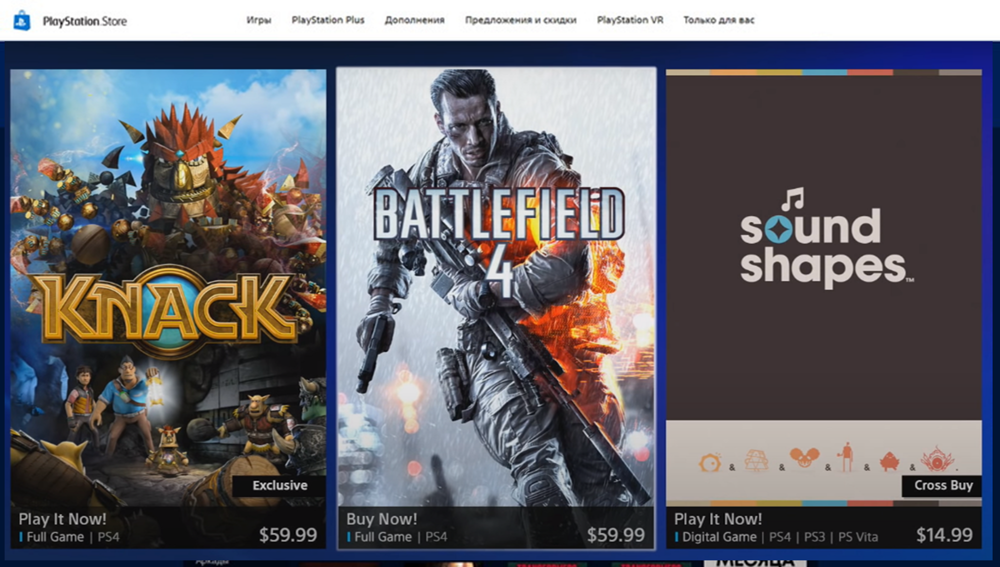
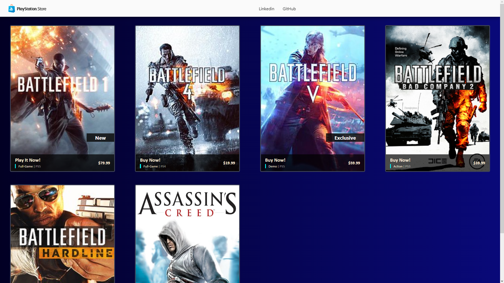

# Santander Bootcamp 2023 - Fullstack Java+Angular - PSN Store

Foi desenvolvido nesse modulo "Ganhando Produtividade com Angular", um clone da PSN Store utilizando como referência:

Ministrado pelo professor
[Felipe Aguiar](https://www.linkedin.com/in/felipe-me/),
pela plataforma
[Digital Innovation One](https://www.dio.me/en).

**Desenvolvido com:** 

## Sobre o projeto

Este projeto é baseado na PSN Store, apresentando uma lista de jogos, onde dado enfasê na criação de componentes inteligentes.

